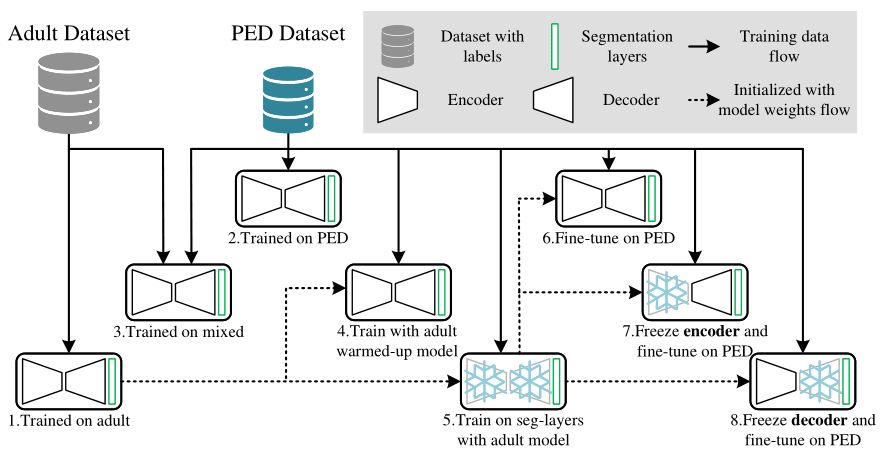
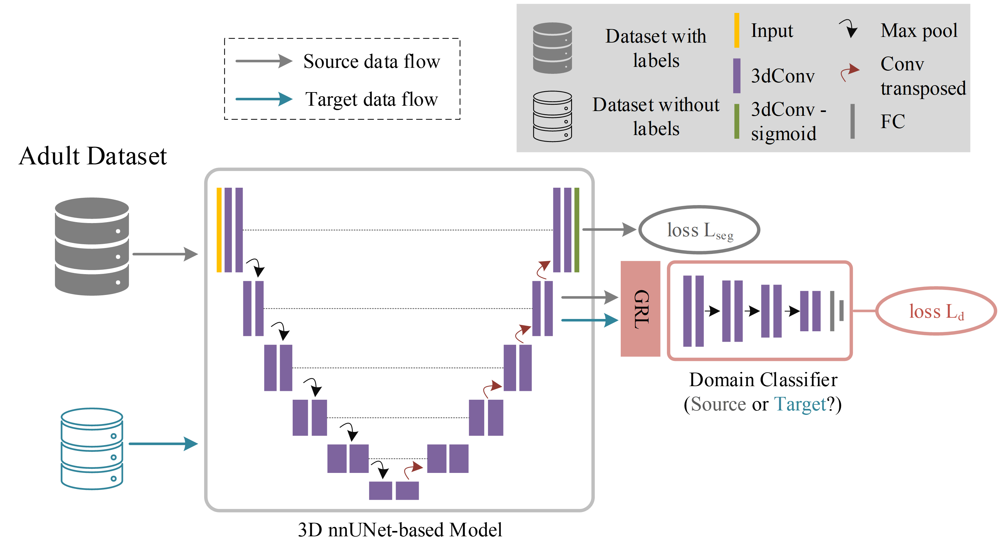
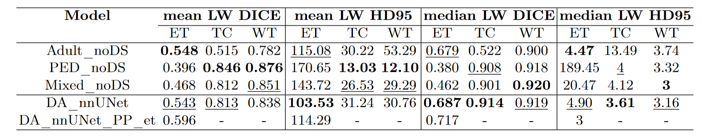

# DA-nnUNet: Domain-adapted nnU-Net for Pediatric Tumor Segmentation
 

Keywords: Unsupervised Domain Adaptation, Pediatric Tumor Segmentation, Gradient Reversal Layer

This repository contains the source code accompanying the paper:

Fu, Jingru, et al. "Unsupervised Domain Adaptation for Pediatric Brain Tumor Segmentation", 2024.

## Datasets

We utilized two datasets provided by the BraTS challenge organizers: the BraTS 2021 adult glioma dataset and the BraTS-PEDs 2023 dataset. If you need to convert datasets to nnU-Net style, refer to the example script provided [here](nnunetv2/dataset_conversion/Dataset140_BraTS23_PED.py).

## nnUNetTrainer

The main developed source code resides in the `nnunetv2/training/nnUNetTrainer/customized` directory. You can seamlessly integrate the new nnUNetTrainer into the nnUNet framework.

### Transfer Learning and Fine-Tuning using nnUNet

We presented four strategies (associated with models 5~8 in the above figure) for transfer learning or fine-tuning within nnUNet:

- Train on segmentation-related layers only: `nnUNetTrainer_TL` in [nnUNetTrainer_TL](nnunetv2/training/nnUNetTrainer/customized/nnUNetTrainer_TL.py).
- Fine-tune with a smaller learning rate over 300 epochs: `nnUNetTrainer_TL_FT_1en5_300epochs` in [nnUNetTrainer_TL](nnunetv2/training/nnUNetTrainer/customized/nnUNetTrainer_TL.py).
- Fine-tune with a smaller learning rate over 300 epochs on the encoder only: `nnUNetTrainer_TL_FTen_1en5_300epochs` in [nnUNetTrainer_TL](nnunetv2/training/nnUNetTrainer/customized/nnUNetTrainer_TL.py).
- Fine-tune with a smaller learning rate over 300 epochs on the decoder only: `nnUNetTrainer_TL_FTde_1en5_300epochs` in [nnUNetTrainer_TL](nnunetv2/training/nnUNetTrainer/customized/nnUNetTrainer_TL.py).

### DA-nnUNet

To use DA-nnUNet, use the following example nnUNetTrainer:

- DA-nnUNet training with 500 epochs and 4 convolutional layers in the domain classifier without deep supervision: `nnUNetTrainerDA_500ep_noDS_4Convs` in [nnUNetTrainer_DANN](nnunetv2/training/nnUNetTrainer/customized/nnUNetTrainer_DANN.py).

### Usage Example

To train your model, run the following command:

`nnUNetv2_train 142 3d_fullres_bs4 0 -tr nnUNetTrainerDA_500ep_noDS_4Convs --npz`

## Customizable Components

Explore these components to experiment with DA-nnUNet:

- **Domain balanced dataloader:** Use `nnUNetDataLoader3D_Balanced` in [data_loader_3d_balanced](nnunetv2/training/dataloading/data_loader_3d_balanced.py) to balance inputs for the domain classifier in each batch.
- **Architecture:** Implementations for integrating the domain classifier into the nnUNet backbone are available in [unet_da](nnunetv2/training/nnUNetTrainer/customized/unet_da.py):
  - `PlainConvUNet_DA`: Domain classifier placed in the bottleneck of the UNet.
  - `PlainConvUNet_DAonDecoder`: Domain classifier placed in the decoder of the UNet.
- **Schedulers:** Use `DALRScheduler` or `GRLAlphaScheduler` in [schedulers](nnunetv2/training/nnUNetTrainer/customized/schedulers.py).

## Evaluation
We used the [official metrics](https://github.com/rachitsaluja/BraTS-2023-Metrics) provided by the BraTS 2023 challenge to evaluate our results.

## Results
In our paper, we reported the mean and median DSC and HD95 metrics. Lesion-wise results are also available in the [`results`](results/UnsupervisedDA/) folder. We employed a [post-processing strategy](https://github.com/Precision-Medical-Imaging-Group/BraTS2023-inferCode/blob/main/postproc/postprocess.py) (See code [here](postprocess_PED.py)) from the BraTS 2023 PED challenge winner to redefine the ET region using an optimal ET/WT ratio threshold of 1 (shown in the last row of the table below). The summarized Lesion-Wise (LW) metrics are shown below:

## Citation
If you find this code useful for your research, please consider citing:

     @article{fu2024unsupervised,
      title={Unsupervised Domain Adaptation for Pediatric Brain Tumor Segmentation},
      author={Fu, Jingru and Bendazzoli, Simone and Smedby, {\"O}rjan and Moreno, Rodrigo},
      journal={arXiv preprint arXiv:2406.16848},
      year={2024}
      }

    
## Acknowledgements
This repository is based on [nnU-Net](https://github.com/MIC-DKFZ/nnUNet). We appreciate their excellent work! 
